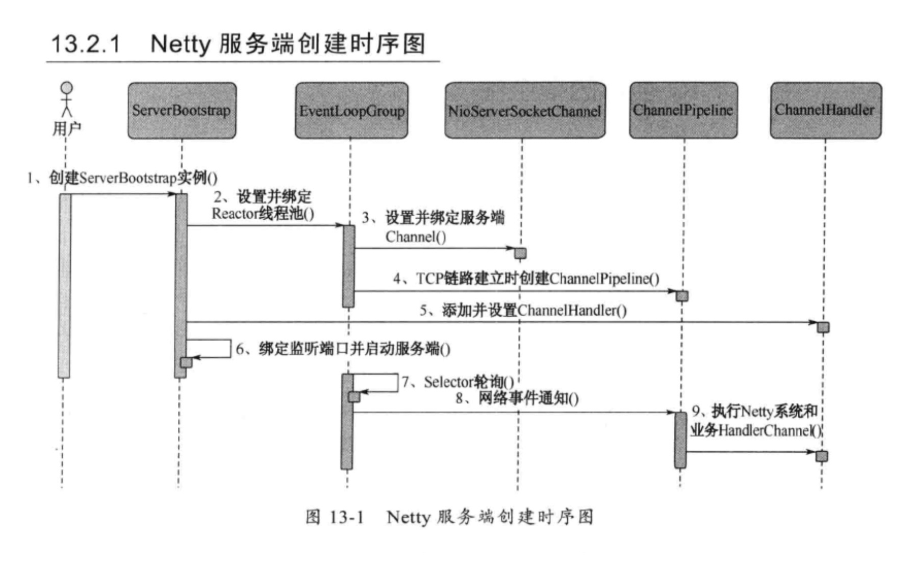
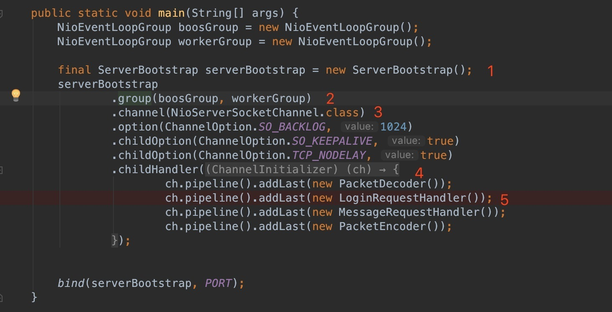
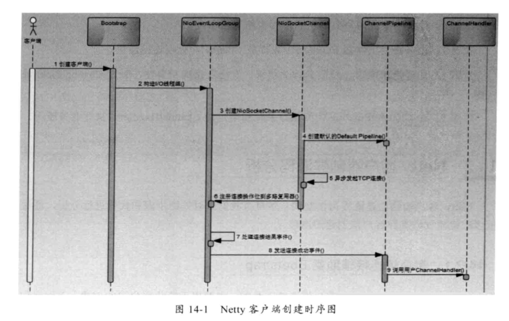
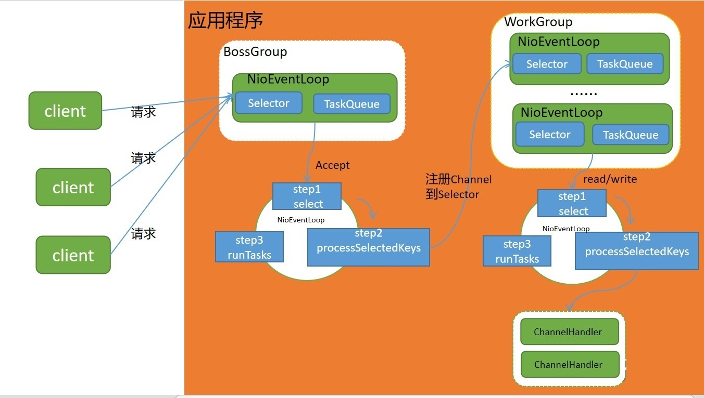

# Netty

## Netty 概念

Netty 基于 NIO 基础之上，使用典型的三层网络架构，Reactor 通信调度层 -> 职责链 PipeLine -> 业务逻辑处理层

1. Reactor 层主要监听网络的读写和连接操作，负责将网络层的数据读取到内存缓冲区中，然后触发网络事件；（`NioEventLoop`，`NioSocketChannel`/`NioServerSocketChannel`）
2. PipeLine 充当职责链有序的处理相应事件，责任链可以选中监听和处理自己关心的事件，同时拦截处理和向前/向后传播事件；

## TCP 粘包/拆包

粘包/拆包出现在服务器/客户端通讯中，收发数据出现的现象：
从服务端的控制台输出可以看出，存在三种类型的输出

1. 一种是正常的字符串输出。
2. 一种是多个字符串“粘”在了一起，我们定义这种 ByteBuf 为粘包。
3. 一种是一个字符串被“拆”开，形成一个破碎的包，我们定义这种 ByteBuf 为半包。

Netty 提供了 4 中拆包器：

1. 固定长度的拆包器 `FixedLengthFrameDecoder`
2. 行拆包器 `LineBasedFrameDecoder`
3. 分隔符拆包器 `DelimiterBasedFrameDecoder`
4. 基于长度域拆包器 `LengthFieldBasedFrameDecoder`

## Netty 的零拷贝

### 传统意义的拷贝

是在发送数据的时候，传统的实现方式是：

1. `File.read(bytes)`
2. `Socket.send(bytes)`

这种方式需要四次数据拷贝和四次上下文切换：

1. 数据从磁盘读取到内核的 read buffer
2. 数据从内核缓冲区拷贝到用户缓冲区
3. 数据从用户缓冲区拷贝到内核的 socket buffer
4. 数据从内核的 socket buffer 拷贝到网卡接口（硬件）的缓冲区

### 零拷贝的概念

明显上面的第二步和第三步是没有必要的，通过 java 的`FileChannel.transferTo`方法，可以避免上面两次多余的拷贝（当然这需要底层操作系统支持）

1. 调用 `transferTo`,数据从文件由 DMA 引擎拷贝到内核 read buffer
2. 接着 DMA 从内核 read buffer 将数据拷贝到网卡接口 buffer

上面的两次操作都不需要 CPU 参与，所以就达到了零拷贝。

几个重要的概念：

1. `ByteBuf` 使用对外内存（DirectMemory）直接进行 Socket 读写；
2. `CompositeByteBuf` 在进行多个 Buffer 组合时，并没有使用多个数组进行数据拷贝，而是使用他们的引用，从而避免了数据的拷贝；
3. `FileChannel.transferTo` 该方法依赖于操作系统实现零拷贝（需要底层操作系统支持）；

## Netty 内部执行流程

### Server 端





1. 创建 `ServerBootStrap` 实例；
2. 设置并绑定 Reactor 线程池：`EventLoopGroup`，`EventLoop` 就是处理所有注册到本线程的 Selector 上面的 Channel；
3. 设置并绑定服务端的 channel；
4. TCP 链路建立时创建处理网络事件的 `ChannelPipeline` 和 `handler`；
5. 网络时间以流的形式在其中流转，`handler` 完成多数的功能定制：比如编解码 SSl 安全认证；
6. 绑定并启动监听端口；
7. 当轮训到准备就绪的 channel 后，由 Reactor 线程：`NioEventLoop` 执行 pipline 中的方法，最终调度并执行 `channelHandler`；

### client 端




## Netty 工作原理示



1. Netty 抽象出两组线程池 **BossGroup** 专门负责接收客户端的连接, **WorkerGroup** 专门负责网络的读写；
2. **BossGroup** 和 **WorkerGroup** 类型都是 `NioEventLoopGroup`； `NioEventLoopGroup` 相当于一个事件循环组, 这个组中含有多个事件循环 ，每一个事件循环是 `NioEventLoop`；
3. `NioEventLoop` 表示一个不断循环的执行处理任务的线程， 每个 `NioEventLoop` 都有一个 Selector , 用于监听绑定在其上的 socket 的网络通讯；`NioEventLoop` 内部采用串行化设计，从消息的读取->解码->处理->编码->发送，始终由 IO 线程 NioEventLoop 负责；
   3.1. `NioEventLoopGroup` 下包含多个 `NioEventLoop`；
   3.2. 每个 `NioEventLoop` 中包含有一个 `Selector`，一个 `TaskQueue`；
   3.3. 每个 `NioEventLoop` 的 `Selector` 上可以注册监听多个 `NioChannel`；
   3.4. 每个 `NioChannel` 只会绑定在唯一的 `NioEventLoop` 上；
   3.5. 每个 `NioChannel` 都绑定有一个自己的 `ChannelPipeline`。
4. `NioEventLoopGroup` 可以有多个线程, 即可以含有多个 `NioEventLoop`； 每个 Boss NioEventLoop 循环执行的步骤有 3 步:
   4.1. 轮询 accept 事件 ，
   4.2. 处理 accept 事件 ，与 client 建立连接 , 生成 NioSocketChannel , 并将其注册到某个 worker NIOEventLoop 上的 selector，
5. 处理任务队列的任务，即 runAllTasks； 每个 Worker NIOEventLoop 循环执行的步骤：
   5.1. 轮询 read, write 事件 处理 i/o 事件， 即 read , write 事件，
   5.2. 在对应 NioSocketChannel 处理，
   5.3. 处理任务队列的任务 ， 即 runAllTasks ；每个 Worker NIOEventLoop 处理业务时，会使用 pipeline(管道), pipeline 中包含了 channel , 即通过 pipeline 可以获取到对应通道, 管道中维护了很多的处理器。

## Netty 入门案例

### Server 端

```java
package com.tawe.netty;

import io.netty.bootstrap.Bootstrap;
import io.netty.bootstrap.ServerBootstrap;
import io.netty.channel.ChannelFuture;
import io.netty.channel.ChannelInitializer;
import io.netty.channel.ChannelOption;
import io.netty.channel.EventLoopGroup;
import io.netty.channel.nio.NioEventLoopGroup;
import io.netty.channel.socket.SocketChannel;
import io.netty.channel.socket.nio.NioServerSocketChannel;

public class NettyServer1 {

    public static void main(String[] args) throws InterruptedException {

        //创建一个线程组，接收客户端的连接
        EventLoopGroup bossGroup=new NioEventLoopGroup();
        //创建一个线程组，处理网络操作
        EventLoopGroup workerGroup=new NioEventLoopGroup();

        //创建启动对象来配置参数
        ServerBootstrap b=new ServerBootstrap();
        b.group(bossGroup,workerGroup) //设置两个线程组
        .channel(NioServerSocketChannel.class)  //使用NioServerSocketChannel作为服务器通道的实现
        .option(ChannelOption.SO_BACKLOG,128)  //设置线程队列中等待连接的个数
        .childOption(ChannelOption.SO_KEEPALIVE,true) //保持活动连接状态
        .childHandler(new ChannelInitializer<SocketChannel>() {//创建一个初始化通道的对象
            protected void initChannel(SocketChannel socketChannel) throws Exception {
                socketChannel.pipeline().addLast(new NettyServerHandle1());  //往pipeline链中添加自定义的handle类
            }
        });
        System.out.println("Server is ready....");
        ChannelFuture cf=b.bind(9999).sync();//绑定端口，设置非阻塞。
        System.out.println("Server is starting....");

        //关闭通道，关闭线程组
        cf.channel().closeFuture().sync();
        bossGroup.shutdownGracefully();
        workerGroup.shutdownGracefully();

    }
}
```
```java
package com.tawe.netty;

import io.netty.buffer.ByteBuf;
import io.netty.buffer.Unpooled;
import io.netty.channel.ChannelHandlerContext;
import io.netty.channel.ChannelInboundHandlerAdapter;
import io.netty.util.CharsetUtil;

public class NettyServerHandle1  extends ChannelInboundHandlerAdapter{

    //读取数据的事件
    @Override
    public void channelRead(ChannelHandlerContext ctx, Object msg) throws Exception {
        System.out.println("server:"+ctx);//输出上下文内容
        ByteBuf buf= (ByteBuf) msg;
        System.out.println("客户端发来的消息："+buf.toString(CharsetUtil.UTF_8));
    }

    //数据读取完毕事件
    @Override
    public void channelReadComplete(ChannelHandlerContext ctx) throws Exception {
        //向客户端返回数据
        ctx.writeAndFlush(Unpooled.copiedBuffer("就是没钱",CharsetUtil.UTF_8));
    }

    //处理异常
    @Override
    public void exceptionCaught(ChannelHandlerContext ctx, Throwable cause) throws Exception {
        ctx.close();
    }
}
```

### Client 端

```java
package com.tawe.netty;

import io.netty.bootstrap.Bootstrap;
import io.netty.channel.ChannelFuture;
import io.netty.channel.ChannelInitializer;
import io.netty.channel.EventLoopGroup;
import io.netty.channel.nio.NioEventLoopGroup;
import io.netty.channel.socket.SocketChannel;
import io.netty.channel.socket.nio.NioSocketChannel;

public class NettyClient1 {

    public static void main(String[] args) throws InterruptedException {

        //创建一个线程组
        EventLoopGroup group=new NioEventLoopGroup();

        //创建客户端的启动类
        Bootstrap b=new Bootstrap();

        //设置线程组
        b.group(group)
                .channel(NioSocketChannel.class)//设置客户端通道的实现类
        .handler(new ChannelInitializer<SocketChannel>() {
            protected void initChannel(SocketChannel socketChannel) throws Exception {
                socketChannel.pipeline().addLast(new NettyClientHandle1());
            }
        });

        System.out.println("Client is ready....");
        ChannelFuture cf=null;
        for(int i=0;i<2;i++) {
             cf = b.connect("127.0.0.1", 9999).sync();//连接服务器
        }
        cf.channel().closeFuture().sync();
        group.shutdownGracefully();


    }
}
```

```java
package com.tawe.netty;

import io.netty.buffer.ByteBuf;
import io.netty.buffer.Unpooled;
import io.netty.channel.ChannelHandlerContext;
import io.netty.channel.ChannelInboundHandler;
import io.netty.channel.ChannelInboundHandlerAdapter;
import io.netty.util.CharsetUtil;

public class NettyClientHandle1 extends ChannelInboundHandlerAdapter{

    //通道就绪事件,就绪就可以写出消息了
    @Override
    public void channelActive(ChannelHandlerContext ctx) throws Exception {
        System.out.println("Client:"+ctx);
        ctx.writeAndFlush(Unpooled.copiedBuffer("Sample Text!", CharsetUtil.UTF_8));
    }

    //读取数据的时间


    @Override
    public void channelRead(ChannelHandlerContext ctx, Object msg) throws Exception {
        ByteBuf buf= (ByteBuf) msg;
        System.out.println("服务器发来的消息："+buf.toString(CharsetUtil.UTF_8));
    }
}
```
