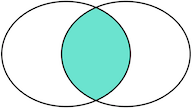
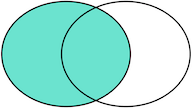

# SQL 笔记

## SQL 简介

SQL = Structured Query Language

总的来说，SQL 语言定义了这么几种操作数据库的能力：

- DDL：Data Definition Language

  DDL 允许用户定义数据，也就是创建表、删除表、修改表结构这些操作。通常，DDL 由数据库管理员执行。

- DML：Data Manipulation Language

  DML 为用户提供添加、删除、更新数据的能力，这些是应用程序对数据库的日常操作。

- DQL：Data Query Language

  DQL 允许用户查询数据，这也是通常最频繁的数据库日常操作。

## 数据库类别

- 关系型数据库(SQL)
- 非关系型数据库(NoSQL) - MongoDB, Cassandra, Dynamo

## 关系模型

### 主键 KEY PRIMARY

主键是关系表中记录的唯一标识。选取主键的一个基本原则是：不使用任何业务相关的字段作为主键。

```SQL
ALTER TABLE <student>
ADD CONSTRAINT <pk_id>
PRIMARY KEY (<id>);
```

### 外键 FOREIGN KEY

外键是用来关联 2 个表结构的，表直接的约束分为以下 3 种：

1. 一对一
2. 一对多 - 外键建立在‘多’的表中(即从表)
3. 多对多 - 需要建立中间表

- 创建外键

  ```SQL
  ALTER TABLE <student>
  ADD CONSTRAINT <fk_class_id>
  FOREIGN KEY (<class_id>)
  REFERENCES classes (<id>);
  ```

- 删除外键

  ```SQL
  ALTER TABLE <students>
  DROP FOREIGN KEY <fk_class_id>;
  ```

### 索引 INDEX

索引是关系数据库中对某一列或多个列的值进行预排序的数据结构。通过使用索引，可以让数据库系统不必扫描整个表，而是直接定位到符合条件的记录，这样就大大加快了查询速度。

```SQL
ALTER TABLE <students>
ADD INDEX <idx_name_score> (<name>, <score>);
```

- 唯一索引

  ```SQL
  ALTER TABLE <students>
  ADD UNIQUE INDEX <uni_name> (<name>);
  ```

### 约束 CONSTRAINT

对表中数据的限制，六大约束：

- NOT NULL - 非空
- DEFAULT - 默认值
- PRIMARY KEY - 主键
- UNIQUE - 唯一约束，可以为空
- CHECK - 检查约束 【MySQL 不支持】
- FOREIGN KEY - 外键

  - ON DELETE RESTRICT - 拒绝主表删除 DEFALUT
  - ON DELETE CASCADE - 级联删除
  - ON DELETE SET NULL - 级联置空
  - ON DELETE NO ACTION - 级联表无操作

- IDENTITY - 标识列 - 自增 - AUTO_INCREMENT
- INDEX - 索引 (普通索引，主键索引，外键索引，约束索引)

- 建立表时：

  - 列级约束 - 直接跟在列定义后即可 NOT NULL/DEFAULT/PRIMARY KEY/UNIQUE
  - 表级约束 - 定义完列后加： PRIMARY KEY/UNIQUE/CHECK/FOREIGN KEY/ - CONSTRAINT pk PRIMARY KEY(id,id2)/CONSTRAINT fk_stu_id_id FOREIGN KEY(stu_id) REFERENCES stu(id)

- 建好的表添加约束：

  - 列级约束 - ALTER TABLE <table> MODIFY COLUMN <column> <Ttype> NOT NULL
  - 表级约束 - ALTER TABLE <table> ADD CONSTRAINT fk_stu_id_id FOREIGN KEY(stu_id) REFERENCES stu(id)

根据业务要求，像身份号、手机号、邮箱地址等，它们具有业务含义不易作为主键，但是又具有唯一性：即不能出现两条记录存储了同一个身份证号。这个时候，就可以给该列添加一个唯一约束。

```SQL
ALTER TABLE <students>
ADD CONSTRAINT <uni_name>
UNIQUE (<name>);
```

## SQL 查询 DQL

不带 `FROM` 子句的 `SELECT` 语句有一个有用的用途，就是用来判断当前到数据库的连接是否有效。许多检测工具会执行一条 `SELECT 1;` 来测试数据库连接。

1. 基本查询 - `SELECT * FROM <students>`
1. 条件查询 - `SELECT * FROM <students> WHERE id = 1`
1. 投影查询 - `SELECT id, name FROM <students>`
1. 排序 - `SELECT * FROM <students> ORDER BY id DESC`
   NOTE: `OREDER BY` 要在 `WHERE` 条件后
1. 分页查询 - `SELECT * FROM <students> LIMIT <10> OFFSET <0>`
   `pageSize` - `LIMIT`
   `pageIndex` - `OFFSET`=`pageSize * (pageIndex - 1)`, `pageIndex` 从 `1` 开始，而 `OFFSET` 从 `0` 开始。
1. 聚合查询
   聚合函数：`COUNT(), SUM(), AVG(), MAX(), MIN()`
   通过 `GROUP BY` 进行分组
   `SELECT <class_id>, <gender>, COUNT(*) num FROM <students> GROUP BY <class_id>, <gender>;`
1. 多表查询 - `SELECT * FROM <students>, <classes>;` 获得的集合为 A 表行数 \* B 表行数
1. 连接查询

   - 内连接(INNER JOIN)
   - 外连接(OUTER JOIN)
     - 左连接(LEFT OUTER JOIN)
     - 右连接(RIGHT OUTER JOIN)
     - 全连接(FULL OUTER JOIN)

   |     INNER JOIN      |     LEFT OUTER JOIN      |     RIGHT OUTER JOIN      |     FULL OUTER JOIN      |
   | :-----------------: | :----------------------: | :-----------------------: | :----------------------: |
   | 两张表都存在的记录  |      左表存在的记录      |      右表存在的记录       |    左右表都存在的记录    |
   |  |  |  |  |

1. 子查询 - `SELECT * FROM <students> WHERE id in (SELECT student_id FROM <classes> WHERE id=1)`

1. 联合查询 - 查询多表/拆分复杂 SQL 语句
   `union` & `union all`

## SQL 数据修改 DML

关系数据库的基本操作就是增删改查，即 `CRUD：Create、Retrieve、Update、Delete`。

对于增、删、改，对应的 SQL 语句分别是：

- `INSERT`：插入新记录 - `INSERT INTO <表名> (字段1, 字段2, ...) VALUES (值1, 值2, ...);`
- `UPDATE`：更新已有记录 - `UPDATE <表名> SET 字段1=值1, 字段2=值2, ... WHERE ...;`
- `DELETE`：删除已有记录 - `DELETE FROM <表名> WHERE ...;`

## SQL 表结构修改 DDL

| SQL 语句                                                                                   | 含义                  |
| ------------------------------------------------------------------------------------------ | --------------------- |
| SHOW DATABASES                                                                             | 列出所有数据库        |
| CREATE DATABASE <database_name>                                                            | 创建数据库            |
| DROP DATABASE <database_name>                                                              | 删除数据库            |
| USE <database_name>                                                                        | 切换当前数据库        |
| SHOW TABLES                                                                                | 列出所有表            |
| DESC <table_name>                                                                          | 查看表结构            |
| SHOW CREATE TABLE <table_name>                                                             | 查看创建表的 SQL 语句 |
| DROP TABLE <table_name>                                                                    | 删除表                |
| ALTER TABLE <table_name> ADD COLUMN <column_name> VARCHAR(10) NOT NULL AFTER <column_name> | 新增列                |
| ALTER TABLE <table_name> CHANGE COLUMN <column_name> VARCHAR(20) NOT NULL                  | 修改列名              |
| ALTER TABLE <table_name> MODIFY COLUMN <column_name> <new_column_name> VARCHAR(20)         | 修改列                |
| ALTER TABLE <table_name> DROP COLUMN <column_name>                                         | 删除列                |
| CREATE TABLE <dest_table_name> LIKE <src_table_name>                                       | 复制表结构            |
| CREATE TABLE <dest_table_name> SELECT \* FROM <src_table_name> WHRER...                    | 复制表                |
| EXIT                                                                                       | 退出 MYSQL 连接       |

## 数据类型

- 数值
  - 整数：tinyint,int,bigint
  - 浮点数 decimal,float,double
- 字符: char, varchar
- 日期: date,time,datetime,timestramp

### 实用 SQL 语句

- 插入或替换
  `REPLACE INTO <students> (<id>, <class_id>, <...>) VALUES(<1>, <1>, <...>)`
  若 `id=1` 记录不存在，插入新纪录； 若 `id=1` 记录存在，当前 `id=1` 记录被删除，然后再插入新纪录。
- 插入或更新
  `INSERT INTO <students> (<id>, <class_id>, <name>, <...>) VALUES(<1>, <1>, <'xiao_min'>, <...>) ON DUPLICATE KEY UPDATE <name>=<'xiao_min'>, <...>;`
  若 `id=1` 记录不存在，插入新纪录； 若 `id=1` 记录存在，当前 `id=1` 记录被更新，更新字段有 `UPDATE` 指定。
- 插入或忽略
  `INSERT IGNORE INTO <students> (<id>, <class_id>, <...>) VALUES(<1>, <1>, <...>);`
  若 `id=1`记录不存在，`INSERT` 语句将插入新记录，否则，不执行任何操作。
- 快照
  `CREATE TABLE <students_of_class1> SELECT * FROM <students> WHERE <class_id>=<1>;`
  通过查询集合创建新表

## 事务操作

- 原子性
- 一致性
- 隔离性
- 持久性

多条语句作为一个整体进行操作的功能，被称为数据库事务。数据库事务可以确保该事务范围内的所有操作都可以全部成功或者全部失败。如果事务失败，那么效果就和没有执行这些 SQL 一样，不会对数据库数据有任何改动。

- `BEGIN` 开启一个事务
- `COMMIT` 提交一个事务
- `ROLLBACK` 回滚事务

### 隔离级别

e.g. 事务 A 与 事务 B 同时进行如下操作：

- **脏读 DIRTY READ**： 可以读到未 commit 的数据；
  查询同一记录，2 次结果**不一样**，B 可以读到 A 还未 commit 的数据结果。  
  如果 A rollback 则 B 读到的 2 次结果不一致；
- **不可重复读 NON REPEATABLE READ**： 可以读到 commit 的数据；
  查询同一记录，2 次结果**不一样**，读到的结果在另一事务 commit/rollback 之间。  
  B 无法读到 A 还未 commit 的数据结果，但是 B 可以读到 A commit 的结果，如果 A commit 则 B 读到的 2 次结果不一致；
- **幻读 PHANTOM READ**：未作 update 操作前，无法读到 commit 的数据；
  查询同一记录，2 次结果是**一样**，但是会出现 事务 A 新增的列，事务 B 读不到(`SELECT`)，但是却可以更新(`UPDATE`)，更新后才可以读到。  
  事务 B 无法读到 A 进行的操作，但是执行 update 操作时（操作到 A 对应的行数据或新增数据）后，在进行查询就可以读到 A 的操作；

| ISOLATION LEVEL  | DIRTY READ | NON REPEATABLE READ | PHANTOM READ |
| :--------------: | :--------: | :-----------------: | :----------: |
| READ UNCOMMITTED |    YES     |         YES         |     YES      |
|  READ COMMITTED  |     -      |         YES         |     YES      |
| Repeatable Read  |     -      |          -          |     YES      |
|   Serializable   |     -      |          -          |      -       |

**Serializable** 虽然隔离级别最高，但是效率会大大下降。

## 视图 VIEW

创建一个虚表（数据仍然引自主表） 和 普通表一样使用，提高 SQL 的重用性，对视图的修改同样会作用到主表上。

`CREATE VIEW <view_name> AS SELECT * FROM <table>`

## 存储过程 PROCEDURE

由于 PROCEDURE 有多条语句，无法判断何时结束，所以得设置结束标记，e.g. 设置 \$ 为结束标记：

`DELIMITER $`

参数：

- IN - 入参 - `IN uname varchar(20)`
- OUT - 返回值 - `OUT uname varchar(20)`
- INOUT - 即可入参也可当返回值 - `INOUT uname varchar(20)`

定义变量：

`DECLARE <para> VARCHAR(20) DEAFULT ""`

```sql
CREATE PROCEDURE <procedure_name>(<params>)
BEGIN
    DECLARE <para> INT;
    ...
END
```

调用：

`CALL <PROCEDURE>`

## 函数 Function

只可以有一个返回值， 存储过程可以有多个返回值；
可以在 SQL 中调用函数；

```sql
CREATE FUNCTION <fun>(num1 FLOAT, num2 FLOAT) RETURNS FLOAT
BEGIN
    DECLARE sum FLOAT DEFAULT 0;
    SELECT <column> INTO sum FROM <table> WHRER ...;
    RETURN(sum);
END
```

## 流程控制

### 分支结构

- IF

  ```sql
  IF <表达式>
  THEN ...;
  ELSE ...;
  END IF;
  ```

- CASE

  ```sql
  CASE <var|表达式|字段>
  WHEN ... THEN ...;
  ELSE ...;
  END CASE;
  ```

- IF 函数

  IF(表达式 1, 表达式 2, 表达式 3)
  如果 表达式 1 为 true, 则返回 表达式 2 的值，否则返回 表达式 3 的值。

### 循环结构

标签名可选

- WHILE - 类似 while - 先判断后执行

  ```sql
  WHILE(循环条件)
  DO ...;
  END WHILE;
  ```

- REPEAT - 类似 do...while - 先执行后判断
  
  ```sql
  REPEAT ...
  UNTIL 循环条件;
  END REPEAT;
  ```

- LOOP - 没有循环条件

  ```sql
  标签名：LOOP
  ...;
  IF 表达式
  THEN LEAVE 标签名; #跳出循环
  END IF;
  END LOOP　标签名;
  ```

iterate 类似于 continue;
leave 类似于 break;
